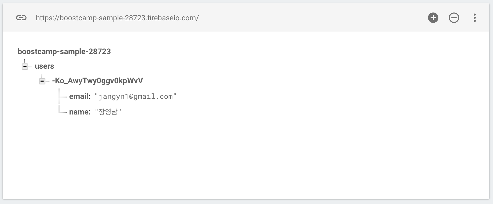
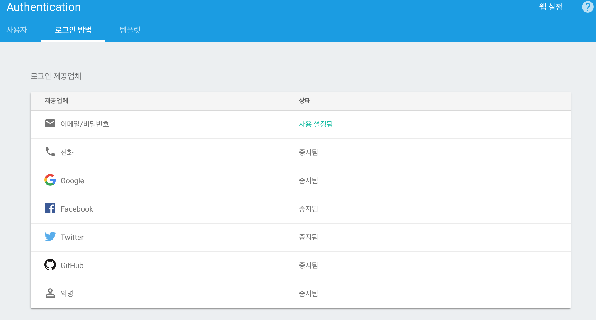
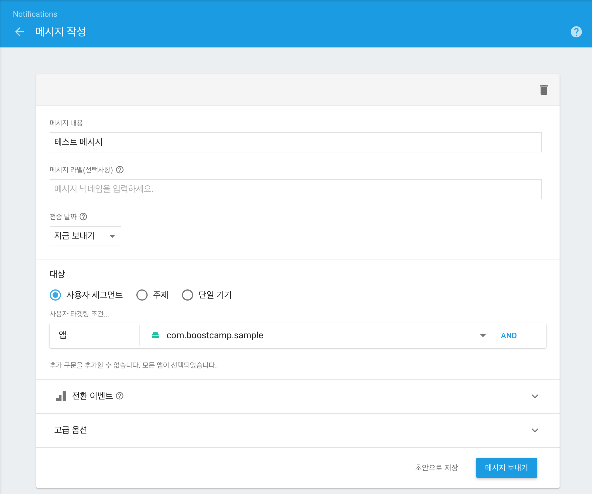
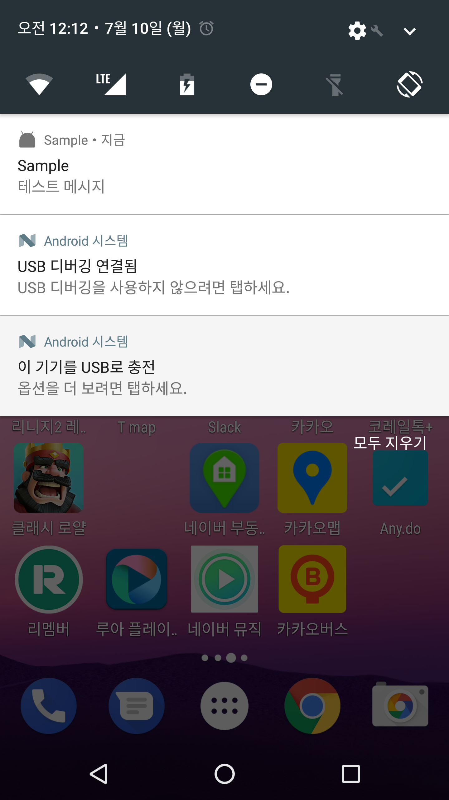

## Firebase 프로젝트 추가

1. [Firebase 콘솔](https://console.firebase.google.com
)에 프로젝트 추가

2. Android 앱에 Firebase 추가

3. SDK추가
루트 수준 build.gradle 파일에 규칙을 추가하여 google-services 플러그인을 포함

	```
	buildscript {
	    // ...
	    dependencies {
	        // ...
	        classpath 'com.google.gms:google-services:3.0.0'
	    }
	}
	```

	앱 수준 build.gradle 파일에 아래 코드를 추가하여 Gradle 플러그인을 사용 설정 함

	```
	apply plugin: 'com.android.application'

	android {
	  // ...
	}

	dependencies {
	  // ...
	  compile 'com.google.firebase:firebase-core:10.2.1'

	  // Getting a "Could not find" error? Make sure you have
	  // the latest Google Repository in the Android SDK manager
	}

	// ADD THIS AT THE BOTTOM
	apply plugin: 'com.google.gms.google-services'
	```

## Firebase Realtime Database

##### Firebase Realtime Database에 users 그룹 하위에 본인의 이름, 이메일을 데이터로 저장하는 실습을 진행합니다.

1. 앱수준 build.gradle 파일에
`
compile 'com.google.firebase:firebase-database:11.0.2'
` 추가

2. 규칙 변경
default 값은 사용자 인증정보가 있는 경우만 처리 할 수 있음.
해당 값을 변경하여 비 인증 사용자라도 데이터를 저장 할 수 있도록 처리 함.
```
/ These rules give anyone, even people who are not users of your app,
// read and write access to your database
{
	"rules": {
	    ".read": true,
	    ".write": true
	}
}
```

3. 결과



## Firebase Authentication

##### Email, 비밀번호를 이용하여 사용자를 가입 시키고, 로그인 처리를 합니다.

1. 앱수준 build.gradle 파일에
`
compile 'com.google.firebase:firebase-auth:11.0.2’`
`compile 'com.google.android.gms:play-services-auth:11.0.2’ `추가

2. 로그인 방법 설정
	1. [Firebase 콘솔](https://console.firebase.google.com/) 인증 페이지 진입
	2. 로그인 방법 탭에서 이메일/비밀번호 로그인 방법을 사용 설정하고 저장 클릭
	

3. 결과


## FCM

##### 단말을 등록하고, Firebase 콘솔에서 테스트 메시지를 발송한다.

1. 앱수준 build.gradle 파일에
`
compile 'com.google.firebase:firebase-messaging:11.0.2'
` 추가
2. Manifest.xml 파일 수정
	1. 토큰 관리를 위한 FirebaseInstanceIdService를 확장하는 서비스를 추가

	```
	<service
		android:name=".MyFirebaseInstanceIDService">
		<intent-filter>
			<action android:name="com.google.firebase.INSTANCE_ID_EVENT"/>
		</intent-filter>
	</service>
	```

	2. FirebaseMessagingService를 확장하는 서비스를 추가.
	```
	<service
		android:name=".MyFirebaseMessagingService">
		<intent-filter>
			<action android:name="com.google.firebase.MESSAGING_EVENT"/>
		</intent-filter>
	</service>
	```

3. 결과






## 오류보고

1. 앱수준 build.gradle 파일에
`compile 'com.google.firebase:firebase-crash:11.0.2'` 추가


2. 첫번째 오류보고 만들기

	`FirebaseCrash.report(new Exception("My first Android non-fatal error"));
`

